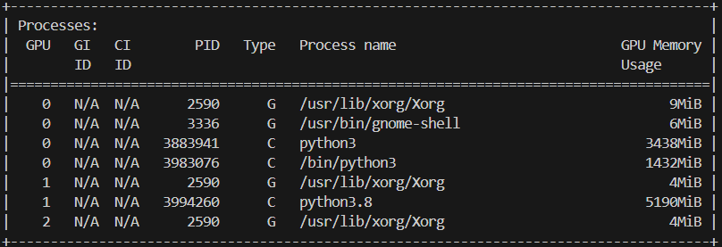

# UNet
PyTorch implementation of UNet.

Comment: Due to memory constraints, UNet is defined using different number of input/output channels as compared to the original paper.

## Generating Masks from Annotations :
- Download "gtFine_trainvaltest.zip" and "leftImg8bit_trainvaltest.zip" from the [official cityscapes website](https://www.cityscapes-dataset.com/downloads/) and extract them in [data/](./data/).
- Run [generate_gt.py](./cityscapes/generate_gt.py), it will generate masks (trainId mask, labelId mask, color mask) as per the conventions of CityScapes Dataset and save them in appropriate directory.
- Comparing the generated mask with provided masks:


## Dataset
Make sure the project folder looks like this:
```
Project/
├── cityscapes/
│   └── ... (python scripts for data loader and utils)
├── data/
│   ├── generated_gt
│   ├── leftImg8bit
│   ├── gtFine
│   └── ... (other files from dataset)
├── unet/
│   └── ... (python scripts for UNet model and utils)
├── outputs/
│   └── ... (output directory)
├── saved/
│   └── ... (save directory during training)
├── save_predictions.ipynb
├── test_unet.py
├── train_unet.py
├── visualize_training.ipynb
└── ... (other files from project)
```


## Training
- Run the following command to train UNet model:
```
python train_unet.py
```

- Training Metrics:
<table style="width: 100%;">
  <tr>
    <td></td>
    <td></td>
  </tr>
  <tr>
    <td></td>
    <td></td>
  </tr>
  <tr>
    <td></td>
    <td></td>
  </tr>
</table>

Comment: The above plots are generated using [visualize_training.ipynb](visualize_training.ipynb)


## Performance
- Run the following command to evaluate UNet model on test set:
```
python test_unet.py --model_weights_path "./saved/{file_name}.pth"
```
- UNet Model evaluation on test set from official evaluation server:

<table style="width: 100%;">
  <tr>
    <td></td>
    <td rowspan="2"></td>
  </tr>
  <tr>
    <td></td>
  </tr>
</table>

Comment: The code saves all the predictions in the directory [outputs/unet/](./outputs/) which can be zipped and uploaded to the official evaluation server to get the model performance evaluated.


## Predictions 
- UNet Model Predictions on CityScapes val: 


## Model Details
- Memory Requirements of UNet Model:

- Average Inference time of UNet Model:


Comment:
- UNet Model (pid=3994260) requires 5.1 GB VRAM for inference on complete image of size 1024 x 2048.
- UNet Model takes about 0.14 seconds for inference on complete image of size 1024 x 2048.
